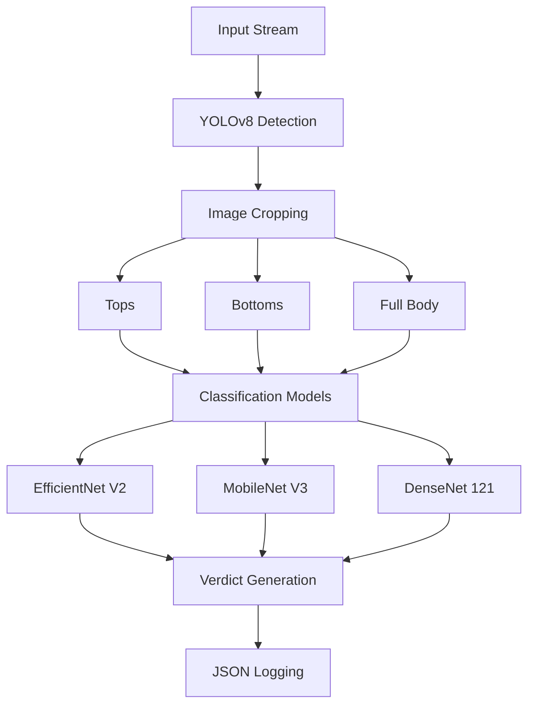

# Deep Learning System for Employee Dress Code Compliance 🚀

[](https://www.python.org)
[](https://pytorch.org)
[](https://docs.ultralytics.com)
[](LICENSE)

## 📋 Table of Contents
- [Deep Learning System for Employee Dress Code Compliance 🚀](#deep-learning-system-for-employee-dress-code-compliance-)
  - [📋 Table of Contents](#-table-of-contents)
  - [🎯 Overview](#-overview)
  - [✨ Key Features](#-key-features)
  - [🏗 Technical Architecture](#-technical-architecture)
  - [📊 Models Performance](#-models-performance)
    - [Classification Models Comparison](#classification-models-comparison)
    - [YOLOv8 Detection Metrics](#yolov8-detection-metrics)
  - [📁 Project Structure](#-project-structure)
  - [📝 Todo](#-todo)
  - [📄 License](#-license)
  - [🙏 Acknowledgments](#-acknowledgments)
  - [📚 References](#-references)

## 🎯 Overview

A state-of-the-art computer vision system designed to automate workplace dress code compliance monitoring using deep learning. The system leverages advanced object detection and image classification techniques to analyze employee attire in real-time, providing automated compliance verification and structured reporting capabilities.

## ✨ Key Features

- **Real-time Human Detection**: Utilizes YOLOv8 for accurate employee detection and tracking
- **Intelligent Clothing Classification**: Implements multiple state-of-the-art models for formal/informal wear classification
- **Multi-segment Analysis**: Separate analysis for tops, bottoms, and full outfits
- **Automated Reporting**: Generates structured JSON logs for compliance tracking
- **High Accuracy**: Achieves 91.25% accuracy with EfficientNet V2 B2
- **Resource Efficient**: Optimized model selection for production deployment

## 🏗 Technical Architecture



## 📊 Models Performance

### Classification Models Comparison

| Model              | Size (MB) | Accuracy | Precision | Recall | F1-Score |
| ------------------ | --------- | -------- | --------- | ------ | -------- |
| EfficientNet V2 B2 | 29 MB     | 91.25%   | 0.92      | 0.91   | 0.91     |
| EfficientNet V2 B0 | 40 MB     | 90.62%   | 0.92      | 0.91   | 0.91     |
| MobileNet V3 Large | 24 MB     | 85.62%   | 0.87      | 0.86   | 0.86     |
| DenseNet 121       | 31 MB     | 84.38%   | 0.86      | 0.84   | 0.84     |

### YOLOv8 Detection Metrics

| Metric    | All classes | Bottom | Complete | Top   |
| --------- | ----------- | ------ | -------- | ----- |
| Precision | 0.830       | 0.886  | 0.830    | 0.775 |
| Recall    | 0.928       | 0.877  | 0.973    | 0.933 |
| mAP@50    | 0.918       | 0.920  | 0.923    | 0.911 |
| mAP@50-95 | 0.604       | 0.554  | 0.706    | 0.552 |


## 📁 Project Structure

```
dress-code-compliance/
├── models/                  # Model architecture definitions
├── data/                   # Dataset and data processing
├── notebooks/              # Jupyter notebooks for analysis
├── README.md/                    # readme file
```

## 📝 Todo

- [ ] Creating REST API for model serving and Docker deployment setup
- [ ] Implement real-time video analysis pipeline
- [ ] Optimize models for edge deployment
- [ ] Integrate with attendance systems

## Team members
1. Harsh Joshi
2. Rajeshwari Mistri
3. Parul Kumari

## 📄 License

This project is licensed under the MIT License - see the [LICENSE](LICENSE) file for details.

## 🙏 Acknowledgments

- The LnT Edutech team for project guidance
- Contributors: Harsh Joshi, Rajeshwari Mistri, Parul Kumari
- PyTorch team for their excellent framework
- Ultralytics for YOLOv8 implementation

## 📚 References

1. [PyTorch Vision](https://pytorch.org/vision/stable/index.html)
2. [Timm Models](https://timm.fast.ai/)
3. [Hugging Face Timm](https://huggingface.co/timm)
4. [YOLOv8 Documentation](https://docs.ultralytics.com/)
5. [EfficientNet Paper](https://arxiv.org/abs/1905.02244)
6. [DenseNet Paper](https://arxiv.org/abs/1608.06993)
7. [MobileNetV3 Paper](https://arxiv.org/abs/1905.11946)
